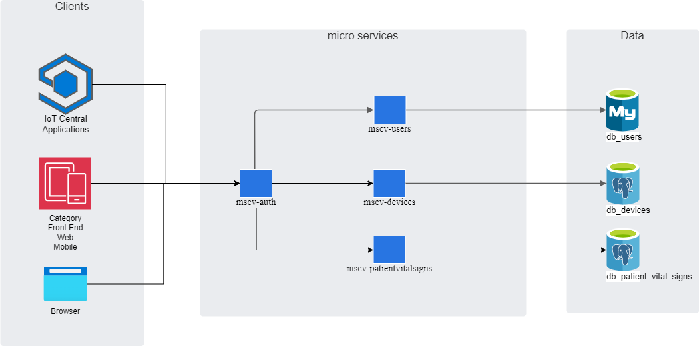

# Backend-SISVIR

## Architecture

The following image shows the backend architecture of the SISVIR application:

## Microservices

#### Api Gateway [sisvir-cloudgateway](https://github.com/carjizo/sisvir-cloudgateway "sisvir-cloudgateway")

#### Authentication and Authorization microservice [msvc-auth](https://github.com/carjizo/msvc-auth "msvc-auth")

#### Users microservice [msvc-users](https://github.com/carjizo/msvc-users "msvc-users")

#### Devices microservice [msvc-devices](https://github.com/carjizo/msvc-devices "msvc-devices")

#### Patient Vital Signs microservice [msvc-patientvitalsigns](https://github.com/carjizo/msvc-patientvitalsigns "msvc-patientvitalsigns")

## Clients

#### IoT-Applications [IoT-SISVIR](https://github.com/carjizo/IoT-SISVIR "IoT-SISVIR")